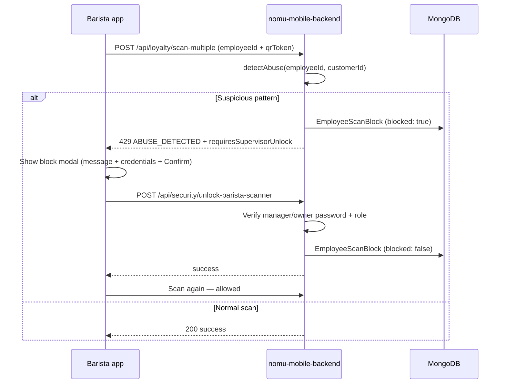

# Abuse Block & Supervisor Unlock

Complete reference for the barista scanner abuse block and manager/owner unlock feature.  
**Production API:** `https://nomu-mobile-backend.onrender.com/api` (not local).

---

## Purpose

When suspicious scanning patterns are detected, the barista/staff account is **paused** so they cannot scan customer QR codes. This prevents abuse while allowing a **false positive** to be fixed on the spot: a **Manager** or **Owner (superadmin)** enters their Nomu admin credentials in the barista app and taps **Confirm** to restore scanning.

**Staff accounts cannot unlock** — only `manager` and `superadmin` roles.

---

## The three applications (web, barista, customer)

| App | Involvement in abuse block |
|-----|----------------------------|
| **Web app** (`01-web-application`) | Shows **abuse alerts** on admin dashboard; hosts APK downloads. **No unlock button on web** — manager/owner unlocks on the barista device using the **same web admin email/password**. |
| **Barista app** (`03-mobile-barista`) | **Primary app for this feature.** Scans QR codes, gets blocked, shows credential modal + **Confirm**, calls unlock API. APK **v1.0.23+24**. |
| **Mobile client app** (`02-mobile-client`) | Customer loyalty QR only. **Not blocked** by barista abuse rules; has separate **12 scans / 12 points per day** limit (PHT midnight reset). APK **v1.0.14+15**. |

Full comparison of all three apps: [APPLICATIONS-OVERVIEW.md](./APPLICATIONS-OVERVIEW.md)

---

## How it works



---

## Abuse triggers

Abuse detection runs on **every loyalty scan** when `employeeId` is sent (barista app always sends the logged-in admin `_id`).

| Pattern | Default threshold | Env variable | Window |
|---------|-------------------|--------------|--------|
| Same customer scanned repeatedly by same employee | 8 | `ABUSE_DETECTION_THRESHOLD_SAME_CUSTOMER` | 1 hour |
| Rapid scans | 10 | `ABUSE_DETECTION_THRESHOLD_RAPID_SCANS` | 1 minute |
| Unusual hours (11 PM – 5 AM) | — | — | barista-backend only |

**Must be enabled in production:**

```env
ENABLE_SUSPICIOUS_PATTERN_DETECTION=true
```

If this is `false` or missing on Render, abuse blocks **never trigger**.

---

## Persistent block (MongoDB)

Collection: **`employeescanblocks`** (Mongoose model `EmployeeScanBlock`)

| Field | Description |
|-------|-------------|
| `employeeId` | Barista/staff admin `_id` (string) |
| `blocked` | `true` while scanner is paused |
| `abuseType` | e.g. `repeated_scans`, `rapid_fire`, `unusual_hours` |
| `reason` | Human-readable message shown in the app |
| `blockedAt` | When the block was applied |
| `unlockedAt` | When a supervisor unlocked |
| `unlockedByEmail` / `unlockedByRole` / `unlockedByName` | Audit trail |

Blocks survive server restarts. In-memory cache is reloaded from MongoDB on connect.

---

## Barista app UI

When the API returns `code: "ABUSE_DETECTED"`, the barista app shows **one modal**:

1. **Title:** Scan blocked  
2. **Message:** Why scanning was paused (from API)  
3. **Manager / owner email** (text field)  
4. **Manager / owner password** (text field)  
5. **Confirm** button  

On success: toast “Scanner unlocked. You can continue scanning.” and the camera resumes.

**App version with this feature:** barista **v1.0.23+24**  
**Widget:** `03-mobile-barista/mobile-barista-frontend/lib/widgets/supervisor_unlock_dialog.dart`

---

## Unlock API

### Endpoint

```http
POST /api/security/unlock-barista-scanner
Content-Type: application/json
```

**Base URL (production):** `https://nomu-mobile-backend.onrender.com/api`

### Request body

```json
{
  "blockedEmployeeId": "<barista admin _id from login>",
  "supervisorEmail": "manager@nomu.cafe",
  "supervisorPassword": "********"
}
```

### Success (200)

```json
{
  "success": true,
  "message": "Scanner unlocked successfully. You can continue scanning."
}
```

### Errors

| Status | Message | Cause |
|--------|---------|--------|
| 400 | Employee ID, supervisor email, and password are required | Missing fields |
| 400 | This scanner is not currently blocked | Already unlocked or wrong employee ID |
| 401 | Invalid supervisor credentials | Wrong email or password |
| 403 | Only a manager or owner can unlock a blocked scanner | Staff role used |
| 500 | Server error | Backend issue |

### Unlock rules

- **Role:** `manager` or `superadmin` only (Owner = `superadmin` in the database)  
- **Auth:** Valid Nomu admin **password** (bcrypt)  
- **Account status:** **Not** checked — inactive managers/owners can still unlock if password is correct  

---

## Scan blocked response

```json
{
  "error": "Suspicious activity detected: the same customer was scanned too many times in a short period.",
  "code": "ABUSE_DETECTED",
  "requiresSupervisorUnlock": true
}
```

HTTP status: **429**

---

## Production deployment

| Component | Render service | Repo path | Auto-deploy on `main` push |
|-----------|----------------|-----------|----------------------------|
| Mobile + barista API | **nomu-mobile-backend** | `02-mobile-client/mobile-backend` | Yes (if linked) |
| Website + APK hosting | **NomuCafe** | `01-web-application/frontend` | Yes (if linked) |

**Barista app does not run on Render** — users install the APK from the website.

### Render env (nomu-mobile-backend)

Required for this feature:

```env
MONGO_URI=<same Atlas URI as web>
JWT_SECRET=<same as web if shared admins>
EMAIL_USER=...
EMAIL_PASS=...
ENABLE_SUSPICIOUS_PATTERN_DETECTION=true
ABUSE_DETECTION_THRESHOLD_SAME_CUSTOMER=8
ABUSE_DETECTION_THRESHOLD_RAPID_SCANS=10
CUSTOMER_MAX_SCANS_PER_DAY=12
CUSTOMER_MAX_POINTS_PER_DAY=12
WEB_BACKEND_URL=https://nomu-backend.onrender.com
```

### APK download links (Nomu site)

| App | Version | Public file | Cache-bust query |
|-----|---------|-------------|------------------|
| Customer | v1.0.14+15 | `/Nomu-Mobile-Application.apk` | `?v=1016` |
| Barista | v1.0.23+24 | `/Nomu-Barista-Application.apk` | `?v=1024` |

Configured in:

- `01-web-application/frontend/src/client/NomuApp.jsx` (customer)  
- `01-web-application/frontend/src/admin/layout/AdminLayout.jsx` (barista, admin portal)  
- `01-web-application/frontend/public/download-apk.html`  

APK binaries live in `01-web-application/frontend/public/`.

### Rebuild APKs (when releasing)

```powershell
# Barista
cd 03-mobile-barista\mobile-barista-frontend
flutter pub get
flutter build apk --release
copy build\app\outputs\flutter-apk\app-release.apk ..\..\..\01-web-application\frontend\public\Nomu-Barista-Application.apk

# Customer
cd 02-mobile-client\mobile-frontend
flutter pub get
flutter build apk --release
copy build\app\outputs\flutter-apk\app-release.apk ..\..\..\01-web-application\frontend\public\Nomu-Mobile-Application.apk
```

Bump `pubspec.yaml` version, update `?v=` in the three link files above, commit, push to `main`, wait for NomuCafe redeploy.

---

## Source code map

| Area | Path |
|------|------|
| Block service (MongoDB + memory) | `02-mobile-client/mobile-backend/services/employeeScanBlockService.js` |
| Scan security helper | `02-mobile-client/mobile-backend/middleware/employeeScanSecurity.js` |
| Abuse detection | `02-mobile-client/mobile-backend/middleware/securityMiddleware.js` → `detectAbuse` |
| Unlock route | `02-mobile-client/mobile-backend/server.js` → `POST /api/security/unlock-barista-scanner` |
| Barista unlock UI | `03-mobile-barista/mobile-barista-frontend/lib/widgets/supervisor_unlock_dialog.dart` |
| Barista scan handler | `03-mobile-barista/mobile-barista-frontend/lib/barista.dart` |
| Barista API client | `03-mobile-barista/mobile-barista-frontend/lib/api/api.dart` → `unlockBaristaScanner` |

Mirrored in `03-mobile-barista/mobile-barista-backend` for local dev; **production barista app uses nomu-mobile-backend only**.

---

## Testing checklist (production)

1. Install barista APK **v1.0.23+24** from the live site.  
2. Log in as **staff** barista account.  
3. Trigger abuse (e.g. scan same customer QR many times within an hour, above threshold).  
4. Confirm **Scan blocked** modal with email/password fields and **Confirm**.  
5. Enter **manager** or **owner** web admin email + password → **Confirm**.  
6. Scan a customer again — should succeed.  
7. Try **staff** credentials in unlock form — should fail with permission error.

---

## Troubleshooting

| Problem | Likely cause | Fix |
|---------|--------------|-----|
| Block never happens | `ENABLE_SUSPICIOUS_PATTERN_DETECTION` not `true` on Render | Set env on nomu-mobile-backend, redeploy |
| Old “Scan blocked” with no credential fields | Old barista APK | Download barista APK `?v=1024` |
| Unlock returns 404 / network error | App pointed at wrong host or backend not deployed | Use `nomu-mobile-backend.onrender.com`; confirm deploy after git push |
| “This scanner is not currently blocked” | Block cleared or wrong `employeeId` | Re-trigger block or verify barista is logged in |
| “Invalid supervisor credentials” | Wrong password or email | Use web admin login credentials for manager/owner |
| “Only a manager or owner can unlock” | Staff account used | Use manager or superadmin account |
| Block returns after unlock | New abuse on next scan | Expected if pattern continues; unlock again or stop trigger behavior |

---

## Related documentation

- [Rate limits](./RATE-LIMITS.md) — daily/hourly caps and abuse thresholds  
- [Render + GitHub](../RENDER_AND_GITHUB.md) — services, URLs, deploy flow  
- [Mobile deployment](../02-mobile-client/MOBILE_DEPLOYMENT.md) — customer APK build  
- [Security implementation](../02-mobile-client/mobile-backend/SECURITY_IMPLEMENTATION.md) — full security stack  

---

**Last updated:** June 2026  
**Git commit:** `d4d188b` — supervisor unlock + barista APK v1.0.23+24  
