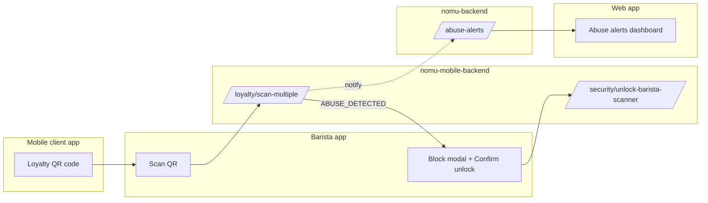

# Nomu Applications Overview

How the **web app**, **barista app**, and **mobile client (customer) app** work together in production — including the abuse block & supervisor unlock feature.

**Production URLs (not local):**

| Service | URL |
|---------|-----|
| Web site (NomuCafe) | https://nomucafe.onrender.com (or https://nomu.cafe) |
| Web API | https://nomu-backend.onrender.com |
| Mobile + barista API | https://nomu-mobile-backend.onrender.com/api |

---

## The three applications at a glance

| | **Web app** | **Barista app** | **Mobile client app** |
|---|-------------|-----------------|------------------------|
| **Who uses it** | Owner, Manager, Staff (admin portal); public visitors (Nomu site) | Staff baristas at the counter | Customers |
| **Platform** | Browser (React) | Android APK (Flutter) | Android APK (Flutter) |
| **Repo folder** | `01-web-application/frontend` | `03-mobile-barista/mobile-barista-frontend` | `02-mobile-client/mobile-frontend` |
| **Backend it calls** | `nomu-backend` | `nomu-mobile-backend` | `nomu-mobile-backend` |
| **Current APK / deploy** | Hosted on Render (NomuCafe) | APK v**1.0.23+24** (`?v=1024`) | APK v**1.0.14+15** (`?v=1016`) |
| **Main job** | Manage cafe (menu, staff, analytics, promos); host APK downloads | Scan customer QR codes; add stamps; inventory | Show loyalty card QR; earn stamps; claim rewards |

---

## 1. Web application

**Folder:** `01-web-application/frontend` + `01-web-application/backend`  
**Deployed as:** NomuCafe (static site) + nomu-backend (API)

### Who logs in

| Role | Access |
|------|--------|
| **Owner (superadmin)** | Full admin portal |
| **Manager** | Admin portal (most modules) |
| **Staff** | Limited admin access (as configured) |
| **Public** | Nomu marketing site, APK download page — no login |

### What it does

- Admin dashboard: menu, inventory, staff, analytics, promos, gallery  
- **Security alerts:** Admin home shows **abuse alerts** when suspicious barista scanning is detected (read-only monitoring)  
- **APK hosting:** Serves download links for customer and barista APKs  
- **Does not** scan customer QR codes at the counter  

### Abuse block & supervisor unlock

| Capability | Web app |
|------------|---------|
| See abuse alerts on dashboard | **Yes** — `AdminHome.jsx` → `/api/abuse-alerts` on **nomu-backend** |
| Unlock a blocked barista scanner | **No UI on web** — unlock is done **on the barista device** (manager/owner enters credentials in the block modal) |
| Manager/owner credentials used for unlock | Same email/password as **web admin login** |

Managers can monitor alerts on the web, but **must go to the barista tablet/phone** to enter credentials and tap **Confirm** when a scanner is paused.

---

## 2. Barista application

**Folder:** `03-mobile-barista/mobile-barista-frontend`  
**APK:** `Nomu-Barista-Application.apk` v**1.0.23+24**

### Who logs in

Staff, Manager, or Owner accounts from the same **`admins`** collection as the web portal (OTP login on first use).

### What it does

- Scan customer loyalty QR codes  
- Record orders and loyalty stamps (`POST /api/loyalty/scan-multiple`)  
- Manual customer lookup if QR fails  
- Inventory stock updates after sales  

### Backend

Always uses **production mobile API** on Android release builds:

```
https://nomu-mobile-backend.onrender.com/api
```

Configured in `lib/config.dart` → `AppConstants.defaultServerHost`.

### Abuse block & supervisor unlock (main app for this feature)

| Step | What happens |
|------|----------------|
| 1 | Barista scans customers; `employeeId` (their admin `_id`) is sent with each scan |
| 2 | If abuse pattern detected → API returns `ABUSE_DETECTED` |
| 3 | **Scan blocked** modal: message + manager/owner email + password + **Confirm** |
| 4 | App calls `POST /api/security/unlock-barista-scanner` |
| 5 | On success → scanning resumes |

**Only Manager or Owner can unlock.** Staff cannot.

Full details: [ABUSE-BLOCK-SUPERVISOR-UNLOCK.md](./ABUSE-BLOCK-SUPERVISOR-UNLOCK.md)

---

## 3. Mobile client application (customer app)

**Folder:** `02-mobile-client/mobile-frontend`  
**APK:** `Nomu-Mobile-Application.apk` v**1.0.14+15**

### Who uses it

Registered **customers** only (not baristas or web admins).

### What it does

- Sign up / log in  
- Display **loyalty QR code** for barista to scan  
- View stamps, rewards, promos, maps, profile  
- Claim rewards in app; barista confirms pickup at counter  

### Backend

Same production API as barista app:

```
https://nomu-mobile-backend.onrender.com/api
```

### Abuse block & supervisor unlock

| Topic | Customer app |
|-------|----------------|
| Barista abuse block | **Not involved** — block applies to the **barista account**, not the customer |
| Customer daily limits | **Yes** — 12 scans / 12 points per day; resets **midnight Philippines time (PHT)** |
| If customer hits daily limit | Barista sees “Daily scan/points limit” dialog (not abuse block) |

Customers are **scanned by** the barista app; they do not unlock barista scanners.

---

## How the apps connect (loyalty scan flow)



---

## APK downloads (from web app)

| App | File | Version | Link on site |
|-----|------|---------|--------------|
| Customer | `Nomu-Mobile-Application.apk` | 1.0.14+15 | Nomu App page, `download-apk.html` |
| Barista | `Nomu-Barista-Application.apk` | 1.0.23+24 | Admin layout, `download-apk.html` |

Files live in `01-web-application/frontend/public/`. Pushing to GitHub redeploys NomuCafe with updated APKs.

---

## Which backend handles what

| Feature | Backend |
|---------|---------|
| Web admin login, menu, analytics | **nomu-backend** |
| Customer/barista login, loyalty scan, unlock scanner | **nomu-mobile-backend** |
| Abuse alert storage & web dashboard | **nomu-backend** (`/api/abuse-alerts`) |
| Employee scan block persistence | **nomu-mobile-backend** (MongoDB `EmployeeScanBlock`) |

Both backends share the **same MongoDB** (`MONGO_URI`) for users, admins, and loyalty data.

---

## Quick reference: abuse feature by app

| App | Role in abuse block feature |
|-----|----------------------------|
| **Web app** | View security alerts; download barista APK; manager credentials are the same as web login |
| **Barista app** | Trigger block, show unlock modal, call unlock API, resume scanning |
| **Mobile client app** | Provides QR to scan; subject to customer daily limits only |

---

## Related documentation

- [Abuse block & supervisor unlock](./ABUSE-BLOCK-SUPERVISOR-UNLOCK.md) — technical detail, API, env vars, testing  
- [Rate limits](./RATE-LIMITS.md) — 12/day customer caps, employee limits, abuse thresholds  
- [Render + GitHub](../RENDER_AND_GITHUB.md) — deploy all services  
- [Mobile deployment](../02-mobile-client/MOBILE_DEPLOYMENT.md) — build customer APK  

---

**Last updated:** June 2026  
