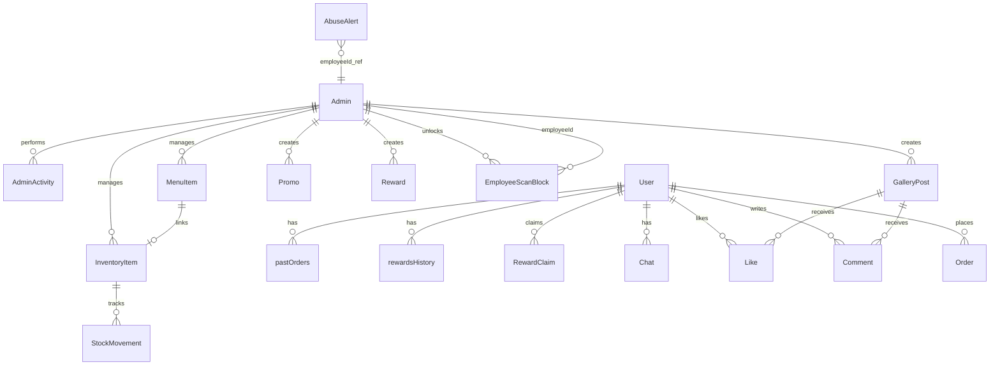
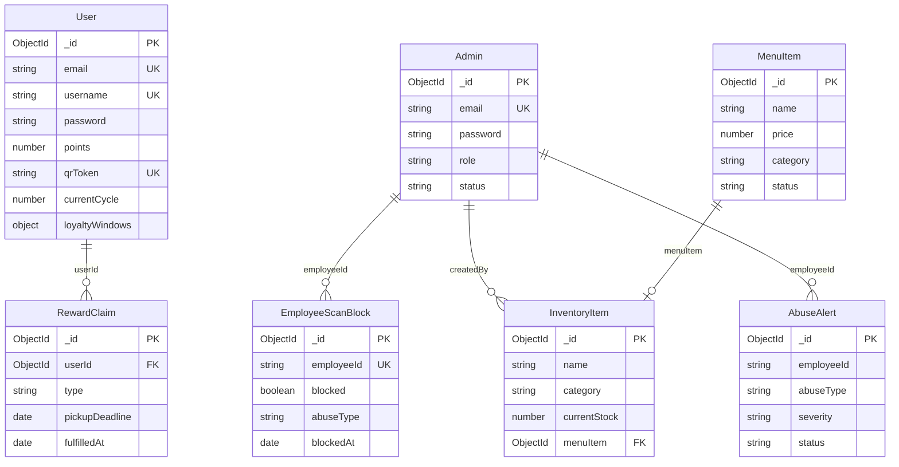

# Nomu Database Schema

MongoDB schema reference for the Nomu Cafe system.  
**Database:** single shared Atlas database (e.g. `nomucafephdb`) used by **nomu-backend** and **nomu-mobile-backend**.

**Connection:** `MONGO_URI` in both backends must match for shared users, admins, loyalty, and inventory.

---

## 1. Overview

| Item | Detail |
|------|--------|
| **Engine** | MongoDB (Atlas in production) |
| **ODM** | Mongoose (Node.js) |
| **Primary DB name** | `nomucafephdb` (typical production) |
| **Web API** | `01-web-application/backend` → most admin/content models |
| **Mobile API** | `02-mobile-client/mobile-backend` → loyalty-extended `User`, `Chat`, `RewardClaim`, `EmployeeScanBlock` |
| **Binary files** | GridFS — buckets: `profile_images`, `promo_images`, `menu_images`, `inventory_images`, `gallery_media` (+ default `fs`) |

### Collection summary

| Collection | Model | Used by | Purpose |
|------------|-------|---------|---------|
| `users` | User | Web + Mobile | Customer accounts, loyalty, QR, orders |
| `admins` | Admin | Web + Mobile + Barista | Owner, Manager, Staff login |
| `menuitems` | MenuItem | Web | Public menu |
| `inventoryitems` | InventoryItem | Web + Mobile | Stock for barista scanner |
| `stockmovements` | StockMovement | Web | Inventory audit trail |
| `rewards` | Reward / Rewards | Web + Mobile | Loyalty reward banners & admin rewards |
| `promos` | Promo | Web + Mobile | Special offers |
| `galleryposts` | GalleryPost | Web | Gallery media |
| `likes` | Like | Web | Gallery likes |
| `comments` | Comment | Web | Gallery comments |
| `feedbacks` | Feedback | Web | Contact / feedback |
| `orders` | Order | Web | Order analytics |
| `rewardclaims` | RewardClaim | Mobile | In-app reward claim & pickup tracking |
| `chats` | Chat | Mobile | Customer chatbot history |
| `abusealerts` | AbuseAlert | Web | Security alerts from barista scans |
| `employeescanblocks` | EmployeeScanBlock | Mobile | Persistent barista scanner abuse blocks |
| `adminactivities` | AdminActivity | Web | Admin audit log (dashboard Recent Activity) |
| `activitylogs` | ActivityLog | Mobile | Mobile-backend activity log (separate from adminactivities) |
| `otps` | OTP | Web | Admin OTP codes (TTL) |
| `tempsignups` | TempSignup | Web | Pending signup (TTL 30 min) |
| `failedattempts` | FailedAttempt | Web | Login lockout tracking (TTL 24 h) |

---

## 2. Entity relationships

### 2.1 Conceptual diagram (relationships only)

This diagram shows **which collections connect to which** — not every field. That is normal for a **conceptual ER diagram** (capstone manuals often use this on one page, then put full field lists in tables below).

| Diagram type | Shows attributes? | Used for |
|--------------|-------------------|----------|
| **Conceptual** (below) | No — entities + relationships only | Big-picture structure |
| **Logical / physical** | Yes — columns/fields on each entity | Detailed schema design |
| **This document §3–7** | Yes — full field tables per collection | Complete reference |

**Full attributes** for every collection are in [§3 Core collections](#3-core-collections) onward — not repeated on the diagram (otherwise it would be unreadable on one page).

---

### 2.2 Key attributes (main entities only)

Logical view with **primary keys and important fields** on the core tables:

Legend: **PK** = primary key (`_id`), **UK** = unique key, **FK** = foreign key (ObjectId reference).

---

## 3. Core collections

### 3.1 `users` — Customers

**Model:** `User`  
**Sources:** `01-web-application/backend/models/User.js`, extended in `02-mobile-client/mobile-backend/server.js`

| Field | Type | Required | Description |
|-------|------|----------|-------------|
| `_id` | ObjectId | auto | Primary key |
| `fullName` | String | yes | Display name |
| `username` | String | yes | Unique login username |
| `email` | String | yes | Unique, lowercase |
| `password` | String | yes | Bcrypt hash |
| `role` | String | — | `Customer` (default), `admin`, `super_admin` |
| `source` | String | — | `web` \| `mobile` (mobile backend) |
| `birthday` | String | yes | `YYYY-MM-DD` |
| `gender` | String | yes | `Male`, `Female`, `Prefer not to say` (web); mobile may use lowercase |
| `employmentStatus` | String | — | `Student`, `Employed`, `Unemployed`, `Prefer not to say` |
| `profilePicture` | String | — | URL or GridFS reference |
| `points` | Number | — | Current stamp count (0–10 per cycle) |
| `currentCycle` | Number | — | Loyalty cycle number (default 1) |
| `reviewPoints` | Number | — | Review bonus points |
| `qrToken` | String | — | Unique loyalty QR token (UUID/JWT) |
| `lastOrder` | String | — | Last order summary text |
| `loyaltyWindows` | Object | — | **Mobile only** — tier claim/pickup windows (see below) |
| `pastOrders` | Array | — | Order history — **web:** `{ drink, quantity, date }`; **mobile:** `{ orderId, cycle, items[], totalPrice, date }` |
| `rewardsHistory` | Array | — | Claimed rewards history — shape differs by backend (see below) |
| `createdAt` | Date | — | Registration time |
| `updatedAt` | Date | — | Last profile update |

**`rewardsHistory[]` (web — `User.js`)**

| Subfield | Type | Description |
|----------|------|-------------|
| `reward` | String | Reward label |
| `pointsUsed` | Number | Stamps/points consumed |
| `date` | Date | Claim time |
| `type` | String | Reward category |
| `cycle` | Number | Loyalty cycle |

**`rewardsHistory[]` (mobile — `server.js`)**

| Subfield | Type | Description |
|----------|------|-------------|
| `type` | String | e.g. `donut`, `coffee`, `pastry`, `bonus` |
| `description` | String | Display text |
| `date` | Date | Claim time |
| `cycle` | Number | Loyalty cycle |
| `loyaltyStampTier` | Number | 5 or 10 — stamp tier at claim |

**`loyaltyWindows` (mobile backend)**

| Subfield | Type | Description |
|----------|------|-------------|
| `cycle` | Number | Cycle this window set belongs to |
| `tier5EligibleAt` | Date | 5-stamp tier unlocked |
| `tier5ClaimBy` | Date | Claim deadline (24 h) |
| `tier5Expired` | Boolean | Tier 5 window expired |
| `tier5RewardClaimed` | Boolean | 5-stamp reward claimed in app |
| `tier10EligibleAt` | Date | 10-stamp tier unlocked |
| `tier10ClaimBy` | Date | Claim deadline (24 h) |
| `tier10Expired` | Boolean | Tier 10 window expired |

**`pastOrders[]` (mobile — nested items)**

| Subfield | Type | Description |
|----------|------|-------------|
| `orderId` | String | Unique order id |
| `cycle` | Number | Loyalty cycle |
| `items[]` | Array | Line items: `itemName`, `itemType`, `category`, `price`, `quantity`, `excludeFromAnalytics`, `rewardBucket`, `rewardDescription` |
| `totalPrice` | Number | Order total (PHP) |
| `date` | Date | Transaction time |

**Indexes:** `email` (unique), `username` (unique), `qrToken` (unique), `createdAt`

---

### 3.2 `admins` — Web & barista staff

**Model:** `Admin`  
**Source:** `01-web-application/backend/models/Admin.js`

| Field | Type | Required | Description |
|-------|------|----------|-------------|
| `_id` | ObjectId | auto | Used as `employeeId` in barista scans |
| `fullName` | String | yes | Display name |
| `email` | String | yes | Unique login email |
| `password` | String | yes | Bcrypt hash |
| `role` | String | yes | `superadmin` (Owner), `manager`, `staff` |
| `status` | String | — | `active` \| `inactive` (default inactive until login) |
| `createdAt` | Date | — | |
| `updatedAt` | Date | — | |
| `lastLoginAt` | Date | — | |
| `firstLoginCompleted` | Boolean | — | |
| `rememberUntil` | Date | — | Skip OTP until this time (24 h remember) |

**Indexes:** `email` (unique)

---

### 3.3 `menuitems` — Public menu

**Model:** `MenuItem`  
**Source:** `01-web-application/backend/models/MenuItem.js`

| Field | Type | Required | Description |
|-------|------|----------|-------------|
| `name` | String | yes | Item name |
| `description` | String | — | |
| `price` | Number | yes | Primary price (PHP) |
| `secondPrice` | Number | — | Alternate size/tier price |
| `category` | String | yes | `Donuts`, `Drinks`, `Pastries`, `Pizzas` |
| `imageUrl` | String | — | |
| `status` | String | — | `active` \| `disabled` |
| `createdAt` / `updatedAt` | Date | — | Timestamps |

---

### 3.4 `inventoryitems` — Barista stock

**Model:** `InventoryItem`  
**Sources:** Web model (full) + mobile backend (synced fields)

| Field | Type | Description |
|-------|------|-------------|
| `menuItem` | ObjectId → MenuItem | Optional link to menu |
| `name` | String | Item name |
| `description` | String | |
| `category` | String | Donuts, Drinks, Pastries, Pizzas |
| `firstPrice` / `secondPrice` | Number | Retail prices (PHP) |
| `sku` / `barcode` | String | Optional unique identifiers |
| `currentStock` | Number | On-hand quantity |
| `minimumThreshold` | Number | Low-stock alert level |
| `maximumThreshold` | Number | Max stock target |
| `supplier` | Object | name, contact, email, phone |
| `storageLocation` | String | |
| `shelfLife` | Number | Days (0 = no expiry) |
| `requiresRefrigeration` | Boolean | |
| `status` | String | `active`, `inactive`, `discontinued` |
| `imageUrl` | String | For barista item picker |
| `notes` | String | |
| `lastRestocked` / `lastSold` | Date | |
| `createdBy` / `updatedBy` | ObjectId → Admin | |
| `sellingPrice` / `unitPrice` / `retailPrice` | Number | Mobile backend price fallbacks |

---

### 3.5 `stockmovements` — Inventory audit

**Model:** `StockMovement`  
**Source:** `01-web-application/backend/models/StockMovement.js`

| Field | Type | Description |
|-------|------|-------------|
| `inventoryItem` | ObjectId → InventoryItem | |
| `movementType` | String | `purchase`, `sale`, `adjustment`, `waste`, `transfer`, `return`, `production`, `inventory` |
| `reason` | String | e.g. `customer_sale`, `manual_adjustment`, `spoiled` |
| `quantity` | Number | Change amount |
| `previousStock` / `newStock` | Number | Before/after levels |
| `referenceNumber` | String | PO / receipt ref |
| `supplier` / `customer` | String | |
| `fromLocation` / `toLocation` | String | |
| `notes` / `batchNumber` | String | |
| `expirationDate` | Date | |
| `createdBy` | ObjectId → Admin | Required |
| `approvedBy` / `approvedAt` | ObjectId / Date | Optional approval |

---

### 3.6 `rewards` — Loyalty rewards

**Models:** `Reward` (web admin) and `Rewards` (mobile banners) — **both use the same MongoDB collection `rewards`**. Documents may follow either shape depending on which API created them; fields are not identical.

**Web (`Reward.js`)** — admin-configured loyalty bonuses:

| Field | Type | Description |
|-------|------|-------------|
| `title` / `description` | String | |
| `rewardType` | String | `Loyalty Bonus` |
| `pointsRequired` | Number | Stamps required |
| `startDate` / `endDate` | Date | Active window |
| `usageLimit` / `currentUsage` | Number | |
| `status` | String | `Active`, `Inactive`, `Scheduled`, `Expired` |
| `createdBy` / `updatedBy` | ObjectId → Admin | |
| `createdAt` / `updatedAt` | Date | Mongoose timestamps |

**Mobile (`Rewards` in server.js)** — customer app banners:

| Field | Type | Description |
|-------|------|-------------|
| `title` / `description` | String | |
| `pointsRequired` | Number | 5 or 10 stamps |
| `rewardType` | String | `donut`, `coffee`, `pastry`, `special`, `Loyalty Bonus` |
| `bannerColor` / `iconName` | String | UI styling |
| `isActive` / `priority` | Boolean / Number | Display order |
| `maxClaimsPerUser` | Number | |
| `startDate` / `endDate` | Date | |
| `status` | String | `Active` (default) |
| `usageLimit` / `currentUsage` | Number | Usage tracking (may mirror web admin rewards) |
| `createdBy` / `updatedBy` | ObjectId → User | |
| `createdAt` / `updatedAt` | Date | Timestamps |

---

### 3.7 `promos` — Promotions

**Model:** `Promo`

| Field | Type | Description |
|-------|------|-------------|
| `title` / `description` | String | |
| `promoType` | String | `Percentage Discount`, `Fixed Amount Discount`, `Buy One Get One`, `Free Item`, `Loyalty Points Bonus` |
| `discountValue` | Number | |
| `minOrderAmount` | Number | |
| `startDate` / `endDate` | Date | |
| `usageLimit` | Number | null = unlimited |
| `status` | String | `Active`, `Inactive`, `Scheduled`, `Expired` |
| `imageUrl` | String | Web |
| `imageId` / `imageFilename` | String | GridFS (mobile) |
| `isActive` | Boolean | |
| `createdBy` / `updatedBy` | ObjectId → Admin or User | |

---

### 3.8 `rewardclaims` — Claim & pickup (mobile)

**Model:** `RewardClaim`  
**Source:** `02-mobile-client/mobile-backend/server.js`

| Field | Type | Description |
|-------|------|-------------|
| `userId` | ObjectId → User | |
| `type` | String | `donut`, `coffee`, `pastry`, `pizza`, `bonus` |
| `description` | String | |
| `date` | Date | Claim time |
| `cycle` | Number | Loyalty cycle |
| `pointsAtClaim` | Number | Stamps at claim |
| `pickupDeadline` | Date | Barista pickup by (Claim + 24 h) |
| `fulfilledAt` | Date | Set when barista completes pickup scan |
| `loyaltyStampTier` | Number | 5 or 10 |
| `bonusPickupsRemaining` | Number | Multi-pickup for tier-10 bonus |

---

## 4. Content & engagement

### 4.1 `galleryposts`

| Field | Type | Description |
|-------|------|-------------|
| `title` / `description` | String | max 100 / 500 chars |
| `media[]` | Array | See subfields below (1–5 items per post) |
| `isActive` | Boolean | |
| `featured` | Boolean | Star / featured on gallery |
| `order` | Number | Sort order |
| `createdBy` | ObjectId → Admin | |
| `tags[]` | String | max 20 chars each |
| `createdAt` / `updatedAt` | Date | Mongoose timestamps |

**`media[]` subfields**

| Subfield | Type | Description |
|----------|------|-------------|
| `type` | String | `image` \| `video` |
| `url` | String | Served URL |
| `filename` | String | Stored filename |
| `originalName` | String | Original upload name |
| `gridfsId` | ObjectId | Reference to `gallery_media` GridFS bucket |
| `mimetype` | String | MIME type |
| `size` | Number | File size in bytes |

### 4.2 `likes`

| Field | Type | Description |
|-------|------|-------------|
| `user` | ObjectId → User | |
| `post` | ObjectId → GalleryPost | |
| `createdAt` | Date | Like time |
| `updatedAt` | Date | Mongoose timestamp |
| Unique index | | `(user, post)` |

### 4.3 `comments`

| Field | Type | Description |
|-------|------|-------------|
| `user` | ObjectId → User | |
| `post` | ObjectId → GalleryPost | |
| `content` | String | max 500 chars |
| `createdAt` | Date | Comment time |
| `updatedAt` | Date | Mongoose timestamp |

### 4.4 `feedbacks`

| Field | Type | Description |
|-------|------|-------------|
| `name` / `email` / `message` | String | From Contact Us |
| `status` | String | `pending` \| `replied` |
| `reply` | String | Admin reply |
| `createdAt` / `repliedAt` | Date | |

---

## 5. Security & operations

### 5.1 `abusealerts`

**Model:** `AbuseAlert` — shown on web Admin Dashboard

| Field | Type | Description |
|-------|------|-------------|
| `type` | String | `abuse_detected`, `abuse_escalation` |
| `employeeId` | String | Barista admin `_id` |
| `customerId` | String | Customer `_id` (optional) |
| `abuseType` | String | `repeated_scans`, `rapid_fire`, `unusual_hours`, `unknown` |
| `details` | Mixed | Count, threshold, time window |
| `severity` | String | `LOW`, `MEDIUM`, `HIGH`, `CRITICAL` |
| `message` | String | Display text |
| `status` | String | `new`, `acknowledged`, `resolved`, `dismissed` |
| `requiresAction` | Boolean | |
| `source` | String | default `mobile_barista` |
| `createdAt` / `updatedAt` | Date | Timestamps |

**Indexes:** `createdAt`, `status`, `severity`, `employeeId`

---

### 5.2 `employeescanblocks` *(new)*

**Model:** `EmployeeScanBlock`  
**Source:** `02-mobile-client/mobile-backend/services/employeeScanBlockService.js`

Persistent barista scanner pause until manager/owner unlocks on device.

| Field | Type | Description |
|-------|------|-------------|
| `employeeId` | String | **Unique** — admin `_id` of blocked barista |
| `blocked` | Boolean | `true` while scanner paused |
| `abuseType` | String | e.g. `repeated_scans`, `rapid_fire` |
| `reason` | String | Message shown in barista app |
| `blockedAt` | Date | When block applied |
| `unlockedAt` | Date | When supervisor unlocked |
| `unlockedByAdminId` | String | Manager/owner admin `_id` |
| `unlockedByEmail` | String | |
| `unlockedByRole` | String | `manager` \| `superadmin` |
| `unlockedByName` | String | |

**Indexes:** `employeeId` (unique)

---

### 5.3 `adminactivities`

**Model:** `AdminActivity` — web admin dashboard “Recent Activity” feed.

| Field | Type | Description |
|-------|------|-------------|
| `adminId` | ObjectId → Admin | |
| `adminName` | String | |
| `action` | String | e.g. created, updated, deleted |
| `entityType` | String | `promo`, `menu`, `user`, `admin`, `feedback`, `reward` |
| `entityId` / `entityName` | ObjectId / String | |
| `details` | String | |
| `timestamp` | Date | |

---

### 5.4 `activitylogs`

**Model:** `ActivityLog`  
**Source:** `02-mobile-client/mobile-backend/services/activityService.js`  
**Note:** Separate from `adminactivities` — used by the mobile backend activity API, not the web admin dashboard.

| Field | Type | Description |
|-------|------|-------------|
| `adminId` | ObjectId → User | Nullable |
| `action` | String | |
| `entityType` | String | `user`, `order`, `product`, `system` |
| `entityId` | ObjectId | |
| `entityName` | String | |
| `details` | String | |
| `source` | String | `web`, `mobile`, `system` |
| `timestamp` | Date | |

---

### 5.5 `otps`

| Field | Type | Description |
|-------|------|-------------|
| `email` | String | |
| `code` | String | 6-digit OTP |
| `type` | String | `admin_login`, `password_reset`, `email_verification` |
| `expiresAt` | Date | TTL index — auto-delete |
| `attempts` | Number | max 3 |
| `isUsed` | Boolean | |
| `createdAt` | Date | When OTP was issued |

**Indexes:** `expiresAt` (TTL), `(email, type, isUsed)`

---

### 5.6 `tempsignups`

Pending customer registration before OTP verification. **TTL: 30 minutes.**

| Field | Type |
|-------|------|
| `email`, `fullName`, `username`, `password`, `birthday`, `gender` | String |
| `ipAddress`, `userAgent` | String |
| `createdAt` | Date |

---

### 5.7 `failedattempts`

Login brute-force tracking. **TTL: 24 hours.**

| Field | Type | Description |
|-------|------|-------------|
| `email` | String | |
| `ipAddress` | String | |
| `userAgent` | String | Browser/client identifier |
| `attemptCount` | Number | Failed attempts in window |
| `lastAttemptAt` | Date | Most recent failed attempt |
| `lockedUntil` | Date | Lockout expiry (15 min after threshold) |
| `isLocked` | Boolean | |
| `type` | String | `login`, `signup`, `otp` |
| `createdAt` | Date | First attempt in this record |

**Indexes:** `(email, ipAddress)`, `lockedUntil`, `createdAt` (TTL 24 h)

---

## 6. Legacy / local-only (not production)

### `customers` — barista local backend only

**Model:** `Customer` in `03-mobile-barista/mobile-barista-backend/server.js`  
**Collection:** `customers`

Legacy schema used only if you run the **local** barista backend against MongoDB. **Production** (Render + mobile-backend) uses the shared **`users`** collection for customers, not `customers`.

---

## 7. Additional collections

### 7.1 `chats` — Customer chatbot (mobile)

**Model:** `Chat`  
**Source:** `02-mobile-client/mobile-backend/server.js`

| Field | Type | Description |
|-------|------|-------------|
| `userId` | ObjectId → User | |
| `messages[]` | Array | `sender` (`user` \| `ai`), `text`, `timestamp` |
| `createdAt` | Date | Thread start time |

---

### 7.2 `orders` — Analytics orders (web)

**Model:** `Order`  
**Source:** `01-web-application/backend/models/Order.js`

Used by the web admin analytics dashboard (separate from loyalty `pastOrders` embedded on `users`).

| Field | Type | Description |
|-------|------|-------------|
| `userId` / `customerId` | ObjectId → User | Either may be set |
| `employmentStatus` | String | For analytics segmentation |
| `items[]` | Array | `name`, `quantity`, `price` |
| `totalAmount` / `transactionTotal` | Number | Order total (PHP) |
| `status` | String | `pending`, `completed`, `cancelled` |
| `orderDate` | Date | Transaction date |
| `notes` | String | Optional admin/note text |
| `createdAt` / `updatedAt` | Date | Mongoose timestamps |

**Indexes:** `userId`, `orderDate`, `status`, `employmentStatus`

---

## 8. GridFS (file storage)

Large binary files are stored in **GridFS buckets** — each bucket creates two MongoDB collections: `{bucketName}.files` and `{bucketName}.chunks`.

| Bucket name | Used by | Referenced from |
|-------------|---------|-----------------|
| `profile_images` | Web + mobile backend | `users.profilePicture`, profile upload API |
| `promo_images` | Web + mobile backend | `promos.imageId` |
| `menu_images` | Web backend only | `menuitems.imageUrl` (`/api/images/menu/:id`) |
| `inventory_images` | Web backend only | `inventoryitems.imageUrl` (`/api/images/inventory/:id`) |
| `gallery_media` | Web backend only | `galleryposts.media[].gridfsId` |
| `fs` (default) | Legacy / fallback | General uploads if no named bucket |

**Source:** `01-web-application/backend/config/gridfs.js` (web); mobile backend uses `profile_images` and `promo_images` buckets directly.

**Metadata on upload:** `originalName`, `uploadDate`, `contentType` (stored in GridFS file document metadata).

---

## 9. Rate-limit & abuse data (not in MongoDB)

These are **in-memory** on the mobile backend (reset on server restart unless persisted elsewhere):

| Store | Key | Data |
|-------|-----|------|
| Employee scans | `employeeId` | Hourly/daily scan timestamps |
| Customer scans | `customerId` | Daily scan/point counts (PHT date key) |
| IP requests | IP address | Request timestamps |

**Persistent** abuse state is only in `employeescanblocks`.

---

## 10. Source file index

| Collection | Primary source file |
|------------|---------------------|
| users | `01-web-application/backend/models/User.js` + `02-mobile-client/mobile-backend/server.js` |
| admins | `01-web-application/backend/models/Admin.js` |
| menuitems | `01-web-application/backend/models/MenuItem.js` |
| inventoryitems | `01-web-application/backend/models/InventoryItem.js` |
| stockmovements | `01-web-application/backend/models/StockMovement.js` |
| rewards | `01-web-application/backend/models/Reward.js` + mobile `Rewards` schema |
| promos | `01-web-application/backend/models/Promo.js` |
| galleryposts | `01-web-application/backend/models/GalleryPost.js` |
| likes | `01-web-application/backend/models/Like.js` |
| comments | `01-web-application/backend/models/Comment.js` |
| feedbacks | `01-web-application/backend/models/Feedback.js` |
| orders | `01-web-application/backend/models/Order.js` |
| rewardclaims | `02-mobile-client/mobile-backend/server.js` |
| chats | `02-mobile-client/mobile-backend/server.js` |
| abusealerts | `01-web-application/backend/models/AbuseAlert.js` |
| employeescanblocks | `02-mobile-client/mobile-backend/services/employeeScanBlockService.js` |
| adminactivities | `01-web-application/backend/models/AdminActivity.js` |
| activitylogs | `02-mobile-client/mobile-backend/services/activityService.js` |
| otps | `01-web-application/backend/models/OTP.js` |
| tempsignups | `01-web-application/backend/models/TempSignup.js` |
| failedattempts | `01-web-application/backend/models/FailedAttempt.js` |

---

## 11. Schema accuracy notes

| Topic | Detail |
|-------|--------|
| **Production DB** | One Atlas database (`nomucafephdb`) shared by web + mobile backends |
| **`rewards` collection** | Web `Reward` and mobile `Rewards` models share one collection; field sets differ |
| **`promos` collection** | Web and mobile both use `Promo`; mobile adds `imageId` / GridFS fields |
| **`users` collection** | Mobile backend extends web `User` with `loyaltyWindows`, richer `pastOrders` |
| **`adminactivities` vs `activitylogs`** | Two collections — do not merge |
| **`customers` collection** | Legacy local barista backend only; production uses `users` |
| **In-memory limits** | Employee/customer rate counters are not MongoDB documents |
| **GridFS buckets** | Five named buckets + default `fs`; each has `.files` and `.chunks` collections |
| **`orders` vs `users.pastOrders`** | `orders` = web analytics collection; `pastOrders` = embedded loyalty history on `users` |
| **`rewardsHistory` shape** | Web and mobile backends use different subdocument fields on the same `users` collection |
| **Mongoose code** | This file describes stored data; always verify against `models/` if code changes |

---

## 12. Related documentation

- [Applications overview](../04-documentation/APPLICATIONS-OVERVIEW.md)
- [Abuse block & supervisor unlock](../04-documentation/ABUSE-BLOCK-SUPERVISOR-UNLOCK.md)
- [Rate limits](../04-documentation/RATE-LIMITS.md)
- [Web + mobile database check](../WEB_AND_MOBILE_API_DATABASE_CHECK.md)

---

**Last updated:** June 2026  
